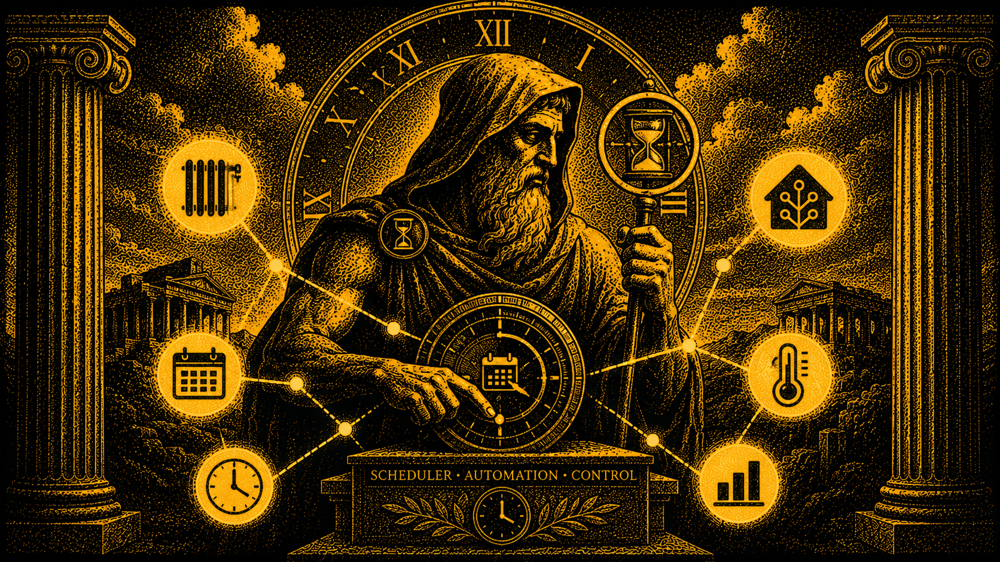

# Chronos Scheduler  

[](https://github.com/hacs/integration)




**Chronos** is an advanced scheduler for Home Assistant. It manages thermostats, lights, blinds, irrigation, switches, fans, water heaters, mowers, vacuums, scenes, automations and alarm panels through daily time slots with **conditional weather rules**.

A single Lovelace card provides:

- Schedule overview with live KPIs
- Linear / radial / list timeline editor with drag-and-drop and 5/15/30/60-minute snap; the chosen view is remembered per schedule, and blocks can't overlap (dragging over a neighbour trims it to the new limit)
- IF/THEN weather rules (temperature, rain, wind, UV, lux, sun position, …) to skip, shift, force, or change duration of the active block
- Scale value now works on sequential irrigation too: the computed value is taken as the TOTAL program length and the per-valve minutes are scaled by a common factor, so "water longer when it's hot" finally works zone by zone while keeping the proportions you set
- Scaled durations are visible on the bar: the block stays solid at the configured duration and a hatched tail shows how far the watering reaches with the rule at its maximum. Plus an editor warning when two irrigation programs sharing days would overlap once their durations are scaled up, which is invisible in the configured times
- Compare two schedules on the timeline: pick another schedule and it is drawn under the linear bar (inside the circle on the radial view). Stretches that overlap the schedule you are editing are outlined in red, which is what you want when two irrigation zones must not run together
- "Hold on threshold" rule effect: a proper twilight switch, on under 20 lx and off over 40 lx, driving BOTH transitions, with a deadband and a confirmation delay so a passing cloud can't make the light flicker. Blocks a rule points at are marked on the timeline with an amber glow and a corner dot
- Rules are independent objects (v1.17+): one rule can drive several schedules at once, and each schedule can combine several rules
- 7-day week view with per-schedule filtering; disabled schedules stay visible, dimmed, so the weekly plan shows what is paused too
- Live status with weather and device readings; the 24h forecast strip is color-coded by severity (green / yellow / orange / red, wind-aware) and shows per-hour wind speed
- Weather rules manager with target chips, a per-schedule filter, and sorting (by linked schedule, alphabetical, or manual drag-and-drop order that persists)
- Device detail view shows the weather rules attached to each linked schedule
- 6-step wizard for guided schedule creation
- Schedule duplication with editable name, devices and days before the copy is created
- JSON export/import to move schedules between Chronos instances (device links travel as entity ids and are re-matched on import)
- Scene schedules: a single schedule that fires one or more scenes per time block (multi-select picker); optional "apply on demand" mode applies the scene only when a member light is switched on during the window, instead of turning everything on at block start
- Automation schedules: a single schedule that turns on/off or triggers one or more HA automations per time block
- Service-call schedules: each block invokes any HA service (mqtt.publish, backup.create, script.run, …) with an optional JSON service_data payload
- Helper entity support: `input_boolean` (flag toggling), `input_number` (numeric values), `input_select` (option selection), so existing automations that use these as conditions don't need rewriting
- Execution history screen with date range filter, schedule / kind / outcome filters, daily bar chart and detailed event list, useful for debugging schedules that didn't fire as expected. Three outcome tiers: green ok, yellow warning (pending offline recall), red error (final failure)
- Per-block device subset: in a multi-device schedule, each block can target a custom subset of those devices
- Recurring yearly date ranges to limit a schedule to specific months/days
- Light advanced parameters (RGB colour, colour temperature, transition) per block
- Per-device and global settings (theme follows Home Assistant, color customisation, sensor-level weather overrides)
- Device pickers show each entity's Home Assistant area, resolved live from the HA registries, so identically named devices (three "Thermostat"s in different rooms) stay distinguishable
- Auto-off timer per block: lights, plugs, fans and climate devices can be switched off automatically N minutes after a turn-on block fires, restart-safe (if HA restarts mid-timer the devices are switched off at startup)
- Offline-device recall: if a target entity is unavailable when its block fires, History records it truthfully (no more false "ok") and the action is retried automatically when the device comes back online, as long as the block is still active. Configurable max attempts, on by default, never fights manual changes (it only arms for devices that were offline at dispatch)
- Missed switch-offs are never lost: if a device is offline when its auto-off timer fires or when an irrigation program closes its valves, Chronos switches it off as soon as it reconnects, regardless of the block window (off-late is the safe direction). Always on, survives HA restarts, gives up after 12h with a note in History
- Confirmation before disabling: switching a schedule or a weather rule off from the card asks first, so a mis-tap can't silence a schedule for days without you noticing. On by default, cancelling leaves the switch untouched, re-enabling never asks, and the `switch.*` entities and `chronos.schedule_toggle` service stay ungated so unattended automations keep working. Turn it off under `Settings → Safety`
- Help screen with 12 ready-made recipes (thermostat day/night, sunset lights, wind-safe blinds, rain-skip irrigation, heat-scaled fan, summer shading, solar-surplus loads, seasonal pool pump, …), quick start, FAQ and glossary
- Compact top navigation (default): menu, clock and screen title merged into a single horizontally scrollable icon bar, freeing the sidebar width for content, especially on phones. The classic sidebar remains available under `Settings → Appearance → Navigation`
- Per-schedule Home Assistant entities (switch + running binary_sensor + next-change sensor) for native dashboards, automations and voice, plus an embeddable single-view card mode (`view: live` / `week` / `overview` / `history`) for placing just one part of Chronos on a normal dashboard
- A dedicated non-interactive status card (`custom:chronos-schedule-card`) recapping one schedule: current/next action, a timeline bar, a toggleable status list, a tri-state activity log, and an optional error "alarm glow"

All persisted by Home Assistant, accessible via WebSocket API, and auto-registered as a custom card.

## Why "Chronos"?

In Greek mythology, Chronos (Χρόνος) is the primordial personification of time itself, the force that orders every day into its hours and seasons. That is what this integration does for your home: it arranges your devices along the day, from a fixed 06:30 to "fifteen minutes before sunset", across weekdays and whole seasons, and keeps them in order for you. The name is a nod to putting time in charge of the house.

## Documentation

The full user guide is in [`docs/USER_GUIDE.md`](docs/USER_GUIDE.md). It covers every section of the card with screenshots: overview, schedule editor (linear / radial / list), weather rules, live status, week view, device management, examples, and settings.

The in-card Help screen has a quick start, a short FAQ, and a link to the full guide.

## Quick start

1. Install Chronos via HACS (see Installation below) and restart Home Assistant.
2. Add the card to any dashboard:
   ```yaml
   type: custom:chronos-card
   ```
3. Open the card and go to **Manage devices** → import the entities you want to control (e.g. `light.living_room`, `climate.kitchen`).
4. Hit **+ New schedule** in the overview, follow the wizard.
5. Add time blocks on the timeline. Each block has a start, an end, an action (e.g. "Turn on at 80%"), and optional weather rules.

A typical first schedule: turn on the living room light from sunset to 23:00. Pick the light, drop a single block from `sunset` to `23:00`, action `Turn on`, brightness `80%`. Save. Done.


## Installation

### Through HACS (recommended)

[](https://my.home-assistant.io/redirect/hacs_repository/?owner=Pricesswg&repository=Chronos-Scheduler&category=integration)

1. Click the badge above to open HACS with this repository pre-filled, then click **Add**
2. Search for "Chronos Scheduler" in HACS, click **Download**
3. Restart Home Assistant
4. Click the badge below to add the integration:

[](https://my.home-assistant.io/redirect/config_flow_start/?domain=chronos)

5. Add the card to any dashboard:

    type: custom:chronos-card

The frontend card is loaded automatically by the integration on every startup via two mechanisms:

1. The bundle is copied to `<config>/www/chronos-card.js` so it's available at `/local/chronos-card.js`.
2. The integration calls `add_extra_js_url` on `/chronos_static/chronos-card.js`, which makes the frontend load the JS and register the `<chronos-card>` custom element. This is enough to use `type: custom:chronos-card` in any dashboard, both storage and YAML mode.

When you install via HACS, HACS also adds a Lovelace resource entry pointing to the bundle. The integration does **not** register that entry on its own (since v1.10.4), to avoid conflicting writes against the resource collection. If you installed manually outside HACS and want a visible Lovelace resource entry too, add it once from **Settings → Dashboards → Resources**:

```yaml
url: /local/chronos-card.js
type: module
```

### Manual installation

1. Copy `custom_components/chronos/` (including `www/chronos-card.js`) into `<config>/custom_components/`
2. Restart Home Assistant
3. Settings → Devices & Services → Add Integration → Chronos Scheduler
4. Add `type: custom:chronos-card` in your dashboard

## First-time setup

On first run the integration asks to select a `weather.*` entity to use as the weather source. You can change it later from the in-card Settings, or even leave it empty if you only rely on point sensors (Ecowitt, WeatherFlow, …) configured per attribute under Settings → Weather source → sensor overrides.

## Card configuration

Most users don't need to configure anything: schedules, devices, weather rules and integration settings live inside the card UI (no YAML to edit). The dashboard's "Edit card" dialog also opens a GUI form for the few presentation options the card exposes.

### Minimal example

```yaml
type: custom:chronos-card
```

That's it — Chronos works out of the box.

### Full example

```yaml
type: custom:chronos-card
title: Home schedules            # optional header above the card
default_screen: overview         # which screen opens first
collapse_sidebar: false          # start with sidebar in mini mode
mobile_threshold: 700            # px below which the drawer layout kicks in
```

### Embed a single view

Set `view` to turn the card into a compact single-screen widget with no sidebar and no top bar, so you can place just one part of Chronos on a normal dashboard:

```yaml
type: custom:chronos-card
view: live      # only the Live status screen, no app chrome
```

Best with the display screens: `live`, `week`, `overview`, `history`. Drop several such cards side by side to compose your own Chronos dashboard. A card without `view` renders the full app as before.

### Available options

| Option              | Type                | Default      | Description                                                                  |
|---------------------|---------------------|--------------|------------------------------------------------------------------------------|
| `title`             | string              | —            | Header text shown above the card. Empty / unset hides the header.            |
| `view`              | string              | —            | Embed a single screen with no chrome: `live`, `week`, `overview`, `history` (any screen works). Unset = the full app. Overrides `default_screen`. |
| `default_screen`    | string              | `overview`   | Initial screen for the full app. One of: `overview`, `editor`, `week`, `weatherRulesList`, `device`, `live`, `wizard`, `devices`, `settings`, `help`. |
| `collapse_sidebar`  | boolean             | `false`      | Start the sidebar collapsed (mini mode) on desktop (classic sidebar layout). |
| `mobile_threshold`  | number              | `700`        | Pixel width below which the card switches to the drawer layout. `0` disables mobile mode. |

All schedule, device and weather-rule data is persisted by the integration via WebSocket API — the card config only controls presentation.

## Schedule status card

A second, non-interactive card type, `custom:chronos-schedule-card`, shows a compact status recap of a single schedule, ideal for pinning to a dashboard:

```yaml
type: custom:chronos-schedule-card
schedule: a1b2c3d4        # the schedule id (copy it from the editor's ID chip)
```

A minimal, bar-only card for a dashboard (useful to lay several irrigation zones side by side) is the same card with everything switched off except the timeline:

```yaml
type: custom:chronos-schedule-card
schedule: a1b2c3d4
compare_with: e5f6g7h8   # optional: draw a second zone under the bar
show_header: false
show_now: false
show_next: false
show_status_active: false
show_status_devices: false
show_status_weather: false
show_status_days: false
show_status_period: false
show_last_activity: false
show_log: false
```

It shows, top to bottom: the schedule name and enabled state, a **Now** line (what it is doing and until when), a **Next** line (next change), a timeline bar in the chosen variant, a simple status list (active, devices, weather rules, days, period), a **last activity** line, and an **activity log** colored by outcome (green for activations, amber for retriggers, red for errors). An optional **alarm glow** pulses a red ring around the card while the newest activity is an error and clears itself on the next successful run.

The card face has no controls; everything is set in the Lovelace "Edit card" dialog. Every section can be toggled off, so you can make it as minimal or as detailed as you want. Colors follow your Home Assistant theme.

| Option | Type | Default | Description |
|---|---|---|---|
| `schedule` | string | — | Schedule id to recap (required). |
| `title` | string | — | Header override; defaults to the schedule name. |
| `timeline_variant` | string | schedule default | `linear`, `radial` or `list`. |
| `log_limit` | number | `6` | Number of activity-log rows. |
| `alarm_glow` | boolean | `true` | Pulse a red glow while the newest activity is an error. |
| `show_header` | boolean | `true` | Name and state pill. Turn it off, leave only the timeline on, and the card is a bare schedule bar. |
| `compare_with` | string | — | Id of a second schedule drawn under the bar for comparison; overlaps are outlined in red. |
| `show_link` | boolean | `false` | Small button that opens Chronos. The card stays read-only. |
| `link_path` | string | `/chronos` | Dashboard path the link button opens. |
| `show_now`, `show_next`, `show_timeline`, `show_weather_ribbon`, `show_status_active`, `show_status_devices`, `show_status_weather`, `show_status_days`, `show_status_period`, `show_last_activity`, `show_log` | boolean | mostly `true` (`show_weather_ribbon` `false`) | Toggle each section. |

## Supported domains

| HA domain        | Chronos type    | Typical capabilities                       |
|------------------|-----------------|--------------------------------------------|
| `climate.*`      | Thermostat / AC | set_temperature, set_hvac_mode (heat, cool, dry, fan_only, auto, …), set_preset, turn_on, turn_off |
| `light.*`        | Light           | turn_on, turn_off, brightness, color       |
| `cover.*`        | Blind           | open, close, set_position                  |
| `switch.*`       | Plug            | turn_on, turn_off                          |
| `fan.*`          | Fan             | turn_on, set_percentage, oscillate         |
| `vacuum.*`       | Vacuum          | start, pause, return_to_base               |
| `lawn_mower.*`   | Mower           | start_mowing, dock, pause                  |
| `water_heater.*` | Water heater    | set_temperature, set_operation_mode        |
| `valve.*`        | Irrigation      | open_valve, close_valve                    |
| `alarm_control_panel.*` | Alarm    | arm_home, arm_away, arm_night, arm_vacation, disarm, trigger |
| `input_boolean.*` | Boolean helper | turn_on, turn_off, toggle (typical use: flip flags consumed by your existing automations) |
| `input_number.*` | Numeric helper  | set_value                                  |
| `input_select.*` | Select helper   | select_option                              |
| `scene.*`        | Scene           | turn_on (multi-select per block, see below) |
| `automation.*`   | Automation      | turn_on, turn_off, trigger (multi-select per block) |
| (no domain)      | Service         | Generic HA service call: any `domain.service` with optional JSON service_data. Useful for `mqtt.publish`, `backup.create`, `script.run`, debug-style invocations |

## Weather rules

Since v1.17 rules live in their own store, decoupled from schedules: a rule has a stable id and a list of targets (`schedule + block`), so a single "wind > 30" rule can close the blinds AND skip the irrigation, and one schedule can combine any number of rules. Existing per-schedule rules are migrated automatically on first start. Effects that use device-specific actions (force action, replace value, scale value) require all linked schedules to share the same device type.

Each rule has:

- **IF** condition: one or more comparisons combined with **AND**. Each comparison is `<key> <op> <threshold>`, where the key can be:
    - a weather attribute (`temperature`, `feels_like`, `humidity`, `dew_point`, `wind_speed`, `wind_gust`, `wind_bearing`, `pressure`, `uv_index`, `solar_radiation`, `illuminance` (lux), `rain_rate`, `rain_state`, `condition`)
    - a sun attribute (`sun.elevation`, `sun.minutes_until_sunrise`, `sun.minutes_until_sunset`, `sun.state`)
    - a forecast attribute (`forecast.temp_max_today`, `forecast.rain_6h`, `forecast.condition_6h`, …)
    - any HA entity_id whose state is read directly: `sensor.*`, `binary_sensor.*`, `number.*`, `input_number.*` (introduced in v1.10 — useful for off-grid setups, battery SOC, PV forecast aggregators, instantaneous power, etc.)

Each weather attribute can be sourced from the configured weather entity OR overridden per-attribute in Settings → Weather source → sensor overrides. Useful when you have a local weather station (Ecowitt, WeatherFlow, Davis) with sensors more accurate than the cloud weather provider — point each attribute at its corresponding `sensor.*` entity.
- **THEN** action: skip the block, shift the start time, force a specific action, change duration, or **hold on threshold** (see below)
- **Fire mode** (when the THEN is "force"):
    - `every` — fires on every false→true transition (use only when desired oscillation is acceptable)
    - `once_per_day` — at most once per calendar day, re-arms at midnight
    - `once_per_daytime` — at most once between sunrise and sunset, re-arms at next sunrise
    - `once_per_nighttime` — at most once between sunset and sunrise, re-arms at next sunset

Rules can be attached to schedules with time blocks (the rule modifies block behaviour) or to schedules with no time blocks at all (pure weather-/sensor-triggered automation).

### Hold on threshold

`force_action` fires once, on the rising edge of its condition, which is right for "close the awning when the wind picks up" and wrong for "keep the light on while it is dark": nothing switches it back. The **hold on threshold** effect drives both directions. Pick the value to follow, an engage threshold with its action, a release threshold with its action:

```text
Illuminance   engage <= 20 lx -> Turn on     release >= 40 lx -> Turn off
```

The order of the thresholds sets the direction (engage below release watches for a drop, engage above release watches for a rise, e.g. a fan over 26 °C off under 24 °C). The gap between them is a deadband, and the confirmation delay makes the new state persist N minutes before acting, so a value hovering on the threshold cannot switch the device on and off endlessly. The block window still decides when the rule may act, and a device switched by hand is left alone until the value crosses a threshold again.

Outdoor lux is rarely published by weather integrations, so `illuminance` normally comes from your own sensor: map it in the sensor overrides, or pick the sensor directly in the rule.

### Compound conditions (AND)

Add as many AND clauses as you need from the rule builder. All clauses must be true for the rule to fire. Examples:

- `sensor.battery_soc > 96 AND sun.minutes_until_sunset > 120` — turn on the second water heater when the off-grid battery is near full and there are at least two hours of sunlight left to keep replenishing it.
- `sensor.battery_soc < 40 AND sensor.pv_forecast_tomorrow_kwh < 8` — switch outdoor lights to low-power mode when the battery is below 40% and the next-day solar forecast is poor.
- `temperature > 28 AND humidity > 70` — extend a fan schedule when both heat and humidity are high.

OR composition is not supported yet — split into two separate rules with the same effect to emulate it.

## Scene and automation schedules

Scenes and automations are not imported as devices. Instead, create a dedicated schedule from the overview:

- **Schedule scenes** — each time block picks one or more `scene.*` entities to activate (multi-select).
- **Schedule automations** — each block picks one or more `automation.*` entities and one of three actions: `turn_on`, `turn_off`, `trigger`.

A single schedule can therefore fire different scenes (or toggle different automations) throughout the day — for example "morning" at 07:00, "movie" at 21:00, "night" at 23:30.

### Apply on demand (scenes)

By default a scene block activates the scene at the start of its time block, which turns on every light the scene controls. When that is not what you want, enable **Apply on demand** on the scene block. In that mode Chronos does not activate the scene at block start; instead it applies the scene only when one of the scene's member entities is switched on during the block window (manually, or by any other automation), and immediately for members that are already on. So nothing lights up on its own, but any light you do turn on during the window gets the block's scene (colour, brightness, ...). The watcher re-arms after a Home Assistant restart.

## Helper entities and service calls

Chronos supports HA helper entities directly so you can keep your existing automations and let Chronos drive their inputs:

- `input_boolean.*` — three actions: turn on, turn off, toggle. The most common pattern is to use these as flag conditions in your existing automations and let Chronos flip them at the right times.
- `input_number.*` — single action `set_value` for numeric helpers used as thresholds.
- `input_select.*` — single action `select_option` for state-machine helpers; the option name is a free string the user types.

For anything else, the **service-call schedule** invokes an arbitrary HA service per block. The block stores a `domain.service` string and an optional JSON `service_data` payload. Examples:

```yaml
# Block 1: morning MQTT announce
service: mqtt.publish
service_data:
  topic: home/morning
  payload: "good morning"

# Block 2: nightly backup
service: backup.create

# Block 3: trigger a custom script
service: script.run
service_data:
  entity_id: script.evening_routine
```

Note on `schedule.*` (HA Schedule helper): Chronos does NOT import these as devices because they're inherently read-only state sources, not action targets. If you want to condition a Chronos block on whether an HA Schedule helper is currently active, reference it directly in the weather rule IF expression: `schedule.work_hours == on`.

## Execution history

A dedicated History screen lists every block dispatch and rule trigger Chronos performed, with date-range and outcome filters. Each entry records timestamp, schedule, target entity, action, value, and ok/error status (with the error message when applicable). The page also shows a daily bar chart split between successful and failed executions. The store keeps the last 5000 events on disk.

Useful for debugging "why didn't my schedule fire" or "did the SOC rule trigger last night".

## Live screen

The Live screen shows current conditions and running schedules at a glance:

- **Weather hero** with temperature, feels-like, and stat chips (humidity, wind, gust, UV, pressure, rain rate) read from your weather entity.
- **Local station compare**: if you mapped local sensors in `Settings → Weather → sensor overrides`, a source switcher appears on the hero. "Local station" reads your own probes, "Compare" shows both sources side by side with a color-coded delta badge per attribute, making drift between your station and the provider visible immediately.
- **Sun card** with a sunrise-to-sunset arc, current sun position, daylight duration, and a countdown to the next sunset/sunrise.
- **Interactive 24h strip**: tap any forecast hour to see its details (condition, temperature, rain amount and probability, wind, humidity). Cells are color-coded by weather severity, wind included.
- **Weather map**: an interactive map (CARTO basemap, OpenStreetMap data) centered on your home zone with an animated precipitation radar (RainViewer, past frames plus nowcast, play/scrub controls). The radar is free and needs no account.
- **Animated weather backdrop**: the hero subtly animates with the current condition: breathing sun glow (cool variant on clear nights), drifting clouds, fog banks, rain with individually randomized drops, storm with wind-slanted rain and lightning flashes, snowfall. Pure CSS behind the content, honors the system reduced-motion preference, and can be turned off in `Settings → Live screen`.

### OpenWeatherMap layers (optional)

The map's extra overlays (temperature, wind, clouds, pressure) use OpenWeatherMap tiles and need a personal API key:

1. Create a free account at [openweathermap.org](https://home.openweathermap.org/users/sign_up).
2. Open the "My API keys" page and copy the default key (a freshly created key can take a few hours to activate).
3. Paste it into `Settings → Live screen → OpenWeatherMap API key`.

Without a key the map still works with the RainViewer radar; the OWM layer chips just stay disabled.

Note: map tiles and radar frames are fetched from the internet by the browser at view time. If your installation must stay fully offline, turn the map off in `Settings → Live screen`; the rest of the Live screen works without any external request.

## Sequential irrigation

Irrigation schedules support two duration modes per time block:

- **Global duration** (default): every valve in the block opens in parallel and closes automatically after the configured minutes (v1.17.1+; previously the duration was informational and the valves stayed open). The running program is restart-safe: if Home Assistant restarts mid-watering, the valves are closed defensively on the next start.
- **Per-valve sequence**: Chronos opens the valves one at a time, each for its own number of minutes, then moves to the next. Total program length is the sum of the individual times. Useful for multi-station controllers where stations must run in sequence (water-pressure constraints).

The mode is chosen in the block editor when the schedule type is irrigation. In sequential mode a row is shown per valve with its own minutes field and a running total.

Safety notes:

- The valve run-time is owned by Chronos (it opens the valve, waits, then closes it). If Home Assistant or the integration restarts mid-program, the valves that were open are closed defensively on the next startup and a restart event is written to the History screen (System kind). This recovery is always on.
- Weather rules are evaluated once, at program start. A skip rule prevents the program from starting; once running it runs to completion.
- If two sequential programs can run on overlapping days and share a valve, the editor warns on save. `Settings → Irrigation → Block save on valve conflict` (off by default) turns that warning into a hard block.

## Per-block device subset

In a multi-device schedule, each time block can target a custom subset of the schedule's devices. The block detail panel shows an "Active devices for this block" chip selector with an "All" pill (default). Toggling individual chips restricts the dispatch for that block only — useful when, say, only 3 of 4 lights should turn on between 22:00 and 23:00, but all 4 should turn off at 06:00.

## Recurring date ranges

Each schedule can be limited to a yearly recurring date range (e.g. 1 May → 30 September). The year is ignored, so the range repeats every year, and ranges that cross year-end are supported (e.g. 1 December → 28 February). When today's date falls outside the range, the schedule is paused without being disabled.

## Time block anchors

Block start and end can be either a fixed hour or anchored to sunrise/sunset with an offset in minutes. The integration resolves the anchor against `sun.sun` on every tick, so a block anchored to `sunset - 15 min` automatically tracks seasonal change.

## Translations

UI is available in Italian, English, French, German, Spanish, Portuguese, Dutch and Polish. Selectable from Settings → Language; defaults to Home Assistant's language. The four newer languages (es/pt/nl/pl) live as overlay dictionaries with English fallback, so a brand-new feature string that hasn't been translated yet shows up in English instead of breaking.

## Support the integration

You can support the development of this scheduler by giving a small donation here:
<a href='https://ko-fi.com/W7W21XGKFV' target='_blank'></a>

## Services

| Service                   | Description                                                              |
|---------------------------|--------------------------------------------------------------------------|
| `chronos.reload`          | Reload Chronos configuration from storage                                |
| `chronos.fire_block`      | Fire the currently active block of a schedule (bypass timing and rules)  |
| `chronos.schedule_toggle` | Enable or disable a schedule from HA automations/scripts. Target by `schedule_id` or by `name` (case-insensitive, must be unique). The automation-friendly equivalent of the card's toggle, and of the per-schedule switch entity below |

Example: disable the irrigation schedule when the vacation input_boolean turns on:

```yaml
automation:
  - alias: Pause irrigation on vacation
    triggers:
      - trigger: state
        entity_id: input_boolean.vacation
        to: "on"
    actions:
      - action: chronos.schedule_toggle
        data:
          name: Garden irrigation
          enabled: false
```

## Entities

Each schedule is also exposed as three Home Assistant entities, grouped under a single **Chronos Scheduler** device. Put them on any dashboard with native cards (tile, entities, mushroom), use them in automations, or trigger them by voice, without embedding the full Chronos card.

| Entity | Type | What it does |
|---|---|---|
| `switch.<schedule>` | switch | Enable/disable the schedule. Same effect as the card's toggle and the `schedule_toggle` service |
| `binary_sensor.<schedule>_active` | binary_sensor (`running`) | On while a block is running now (schedule enabled, runs today, current time inside a block) |
| `sensor.<schedule>_next_change` | sensor (`timestamp`) | When the schedule next changes (a block starting or ending). Attributes: `current_action`, `block_start`, `block_end`, `device_count`, `enabled`, `running` |

Entity IDs are keyed on the schedule's internal id, so renaming a schedule updates the friendly name without breaking automations that reference the entity. Creating or deleting a schedule adds or removes its entities live, no restart needed. The `next_change` time is approximate for sun-anchored blocks on future days.

## Development

Source layout:

```
custom_components/chronos/    # Python integration
├── __init__.py               # Entry, WS commands, frontend card auto-registration
├── scheduler.py              # 1-min tick, weather rule evaluator, action dispatcher
├── store.py                  # Persistence via HA Store API
├── config_flow.py            # Setup UI
├── const.py                  # Device types, actions, weather attributes
├── brand/icon.png            # HA Brands Proxy icon (2026.3+)
└── www/chronos-card.js       # Frontend bundle (committed)

chronos-card/                 # TypeScript / Lit sources
└── src/
    ├── chronos-card.ts       # Main custom element
    ├── timeline.ts           # Linear / radial / list timeline
    ├── i18n.ts               # IT / EN / FR / DE strings
    └── screens/              # 9 screens
```

To rebuild the frontend bundle:

```sh
cd chronos-card
npm install
npm run build
```

Releases are produced via `scripts/release.sh <version> "<release notes>"` which bumps versions in `const.py`, `manifest.json`, and `chronos-card/src/version.ts`, rebuilds, commits, tags, pushes and creates the GitHub release.

## License

MIT — see [LICENSE](LICENSE).
