# Chronos Scheduler User Guide

Chronos Scheduler lets you create visual schedules for Home Assistant entities without writing YAML.

The workflow is simple:

1. Import the Home Assistant entities you want to control.
2. Create a schedule.
3. Add one or more time blocks.
4. Choose what each block should do.
5. Optionally add weather rules.
6. Use the Live status and Week view sections to verify what Chronos is doing.

> **Important**  
> The **Linear**, **Radial** and **List** views are only three different ways to display and edit the same schedule. They do not change how the schedule runs.

---

## Core concepts

### Device

A device is a Home Assistant entity imported into Chronos.

Examples:

```text
light.living_room
climate.living_room_thermostat
switch.water_heater
valve.irrigation_zone_1
cover.bedroom_blind
```

Chronos does not replace the original Home Assistant entity. It only uses that entity as a target for scheduled actions.

---

### Schedule

A schedule is a daily plan made of one or more time blocks.

A schedule can control a single device or multiple compatible devices. For example, one heating schedule can control several thermostat valves, while each time block can still target all devices or only selected devices.

---

### Time block

A time block defines what Chronos should do during a specific part of the day.

Example:

```text
00:00 → 05:00    sleep
05:00 → 08:00    21°C
08:00 → 16:00    away
16:00 → 17:00    boost
17:00 → 22:00    21°C
22:00 → 23:55    sleep
```

Each block has:

| Setting | Description |
|---|---|
| Start time | When the block starts |
| End time | When the block ends |
| Action | What Chronos should do |
| Value | The value used by the selected action |
| Target devices | Which devices are controlled by that block |
| Weather rules | Optional rules that can modify or skip the block |

Available actions depend on the Home Assistant domain of the selected device.

| Device type | Example actions |
|---|---|
| Thermostat | Set temperature, set preset, set HVAC mode |
| Light | Turn on, turn off, brightness, RGB color, color temperature |
| Switch | Turn on, turn off |
| Cover | Open, close, set position |
| Irrigation valve | Open, close |
| Scene | Activate one or more scenes |
| Automation | Turn on, turn off, trigger |

---

## Sections

## Overview

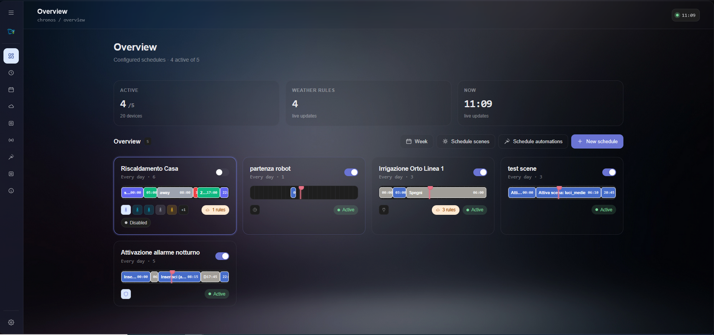

The **Overview** section is the main dashboard of Chronos.

Use this section to quickly check the status of your schedules and access the main actions.

You can see:

| Element | Meaning |
|---|---|
| Active schedules | How many schedules are currently enabled |
| Weather rules | How many weather rules are configured |
| Current time | The time used by Chronos for live updates |
| Schedule cards | Compact previews of each schedule |
| Status badges | Whether a schedule is active, disabled or affected by rules |

From this section you can:

- Create a new schedule.
- Open an existing schedule.
- Enable or disable a schedule.
- Open the Week view.
- Create schedules for scenes.
- Create schedules for automations.

---

## Schedule editor

The **Schedule editor** is where you configure the daily timeline.

Chronos provides three timeline views:

- **Linear**
- **Radial**
- **List**

These are only visual editing sections. They all modify the same schedule.

Changing from Linear to Radial or List does not create a different schedule and does not change the execution logic.

---

### Linear section

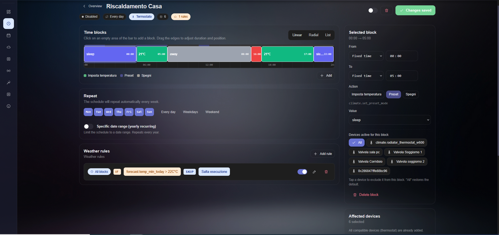

The **Linear** section shows the full 24 hour day as a horizontal timeline.

This is usually the best section for creating or editing a schedule visually.

Use it when you want to:

- Drag blocks on the timeline.
- Resize blocks by changing their start or end time.
- See empty spaces between blocks.
- Check if blocks overlap.
- Understand the full day at a glance.

The timeline follows the snap value configured in Settings.

Example:

| Snap value | Result |
|---|---|
| 5 minutes | More precise editing |
| 15 minutes | Balanced editing |
| 30 minutes | Cleaner schedules |
| 1 hour | Simple routines |

---

### Radial section

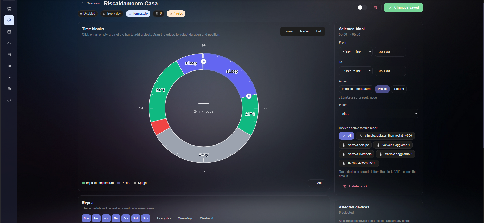

The **Radial** section shows the day as a circular 24 hour timeline.

Use it when you want a more visual representation of the whole daily cycle.

This section is useful for:

- Heating schedules.
- Day and night routines.
- Lighting cycles.
- Schedules that repeat every day.
- Showing the logic of a schedule to another person.

The Radial section is mainly a readability tool. It helps you understand how the day is divided, especially when the schedule has several blocks.

---

### List section

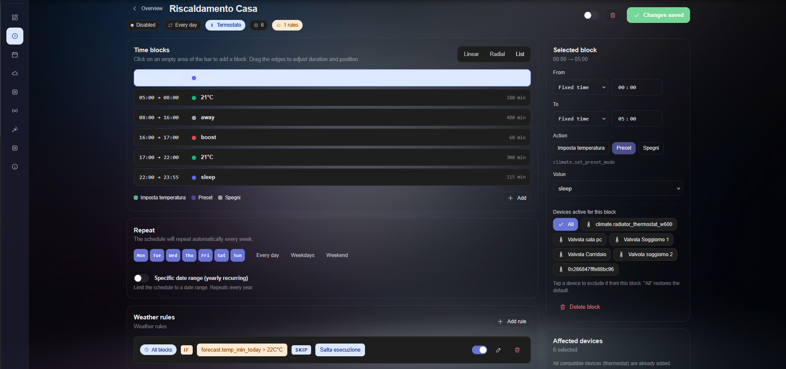

The **List** section shows every time block as a separate row.

Use it when you want maximum precision and less visual clutter.

This section is useful for:

- Checking exact start and end times.
- Editing many blocks.
- Reviewing complex schedules.
- Avoiding mistakes when blocks are close together.

Each row shows:

| Field | Description |
|---|---|
| Time range | Start and end time of the block |
| Action | Action executed by Chronos |
| Duration | Total block duration |

---

## Selected block panel

When you select a time block, the right panel shows the details of that block.

From this panel you can configure:

| Setting | Description |
|---|---|
| From | Start of the block |
| To | End of the block |
| Action | Service or behavior to execute |
| Value | Value used by the selected action |
| Devices active for this block | Devices affected by this block |

A block can use a fixed time or, when supported, a sun based time.

Example:

```text
From: sunset minus 30 minutes
To: 23:00
Action: turn on light
```

This allows schedules to automatically follow seasonal changes.

---

## Devices active for this block

A schedule can control more than one device.

Inside each block, you can decide whether the block applies to all linked devices or only to selected devices.

By default, **All** is selected.

Example:

```text
18:00 → 22:00    turn on only living room lights
22:00 → 23:55    turn off all selected lights
```

This avoids creating many separate schedules when several devices mostly follow the same routine.

---

## Repeat section

The **Repeat** section controls when the schedule is allowed to run.

You can select:

- Individual weekdays.
- Every day.
- Weekdays.
- Weekend.

You can also enable a yearly recurring date range.

This is useful for seasonal schedules.

Examples:

```text
Irrigation active only from May to September
Heating active only from October to April
Christmas lights active only in December
```

When the current date is outside the configured range, the schedule is automatically ignored.

---

## Weather rules section

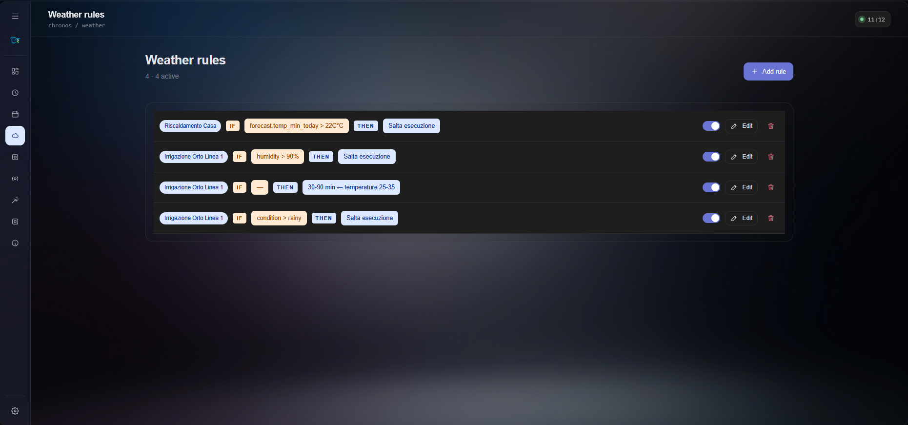

The **Weather rules** section lets Chronos adapt schedules using weather data, forecast data, sun position or Home Assistant sensors.

Each rule follows this logic:

```text
IF condition is true
THEN apply action
```

Examples:

```text
IF forecast.temp_min_today > 22°C
THEN skip heating

IF humidity > 90%
THEN skip irrigation

IF condition is rainy
THEN skip irrigation

IF wind_speed > 30 km/h
THEN close blinds
```

A weather rule can:

| Action | Description |
|---|---|
| Skip execution | The block is not executed |
| Shift block | The block is moved earlier or later |
| Change duration | The block is shortened or extended |
| Force action | A different action is executed |

Weather rules are useful when a fixed schedule is not enough.

For example, irrigation should not run only because it is 06:00. It should also consider rain, humidity, soil moisture or forecast data.

---

## Live status section

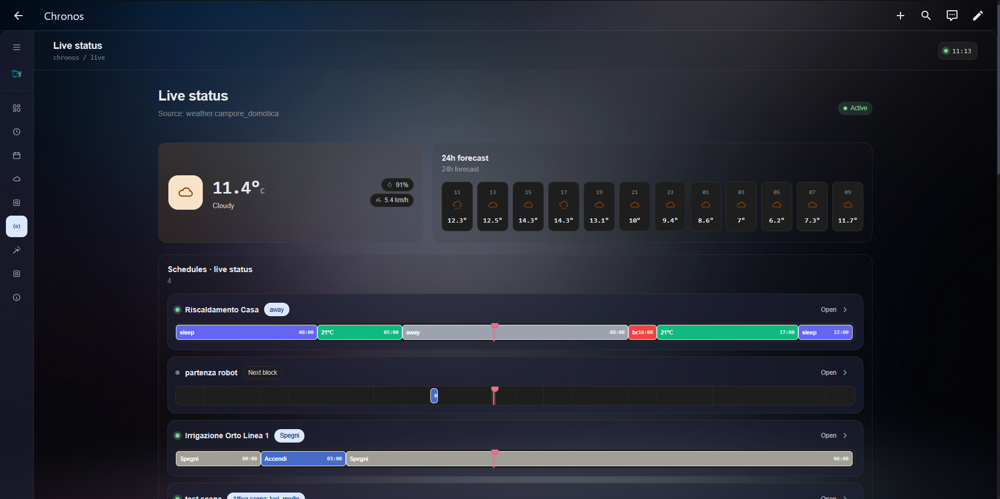

The **Live status** section shows what Chronos is doing right now.

This is the first section to check when something does not behave as expected.

You can see:

| Element | Description |
|---|---|
| Weather source | The Home Assistant weather entity used by Chronos |
| Current weather | Current temperature, condition and other values |
| 24 hour forecast | Forecast data used by rules |
| Active schedules | Schedules currently evaluated by Chronos |
| Current block | The block currently running |
| Next block | The next scheduled block |
| Rule effects | Whether a weather rule is changing the normal behavior |

Use this section to understand why a schedule is running, waiting, skipped or modified.

---

## Week view section

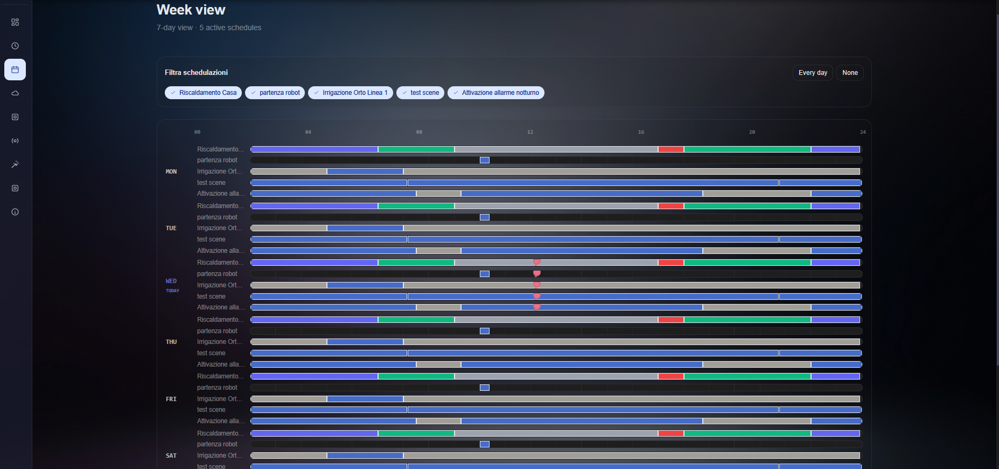

The **Week view** section shows all schedules across the next seven days.

Use this section to verify the complete weekly behavior.

It is useful for:

- Checking schedules that run only on specific days.
- Comparing multiple schedules.
- Finding overlaps.
- Finding unexpected inactive periods.
- Verifying the effect of repeat settings.

You can filter schedules using the chips at the top of the page.

---

## Manage devices section

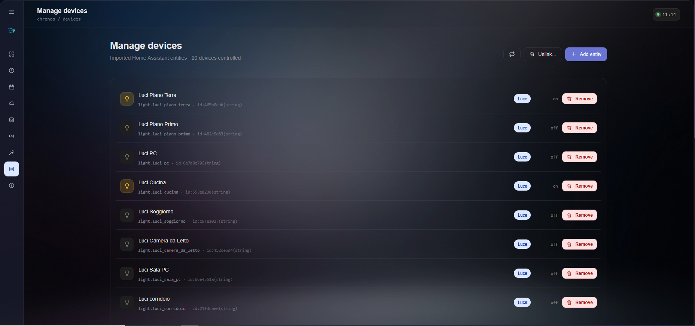

The **Manage devices** section shows the Home Assistant entities imported into Chronos.

Each row shows:

| Field | Description |
|---|---|
| Device name | Friendly name of the entity |
| Entity ID | Home Assistant entity ID |
| Chronos ID | Internal ID used by Chronos |
| Device type | Detected domain or category |
| Current state | Current state reported by Home Assistant |
| Remove | Removes the entity from Chronos |

Use this section to:

- Add a Home Assistant entity to Chronos.
- Remove an entity from Chronos.
- Check if a device is on or off.
- Verify how Chronos classified an entity.

Removing a device from Chronos does not delete it from Home Assistant. It only removes it from Chronos scheduling.

---

## Device detail section

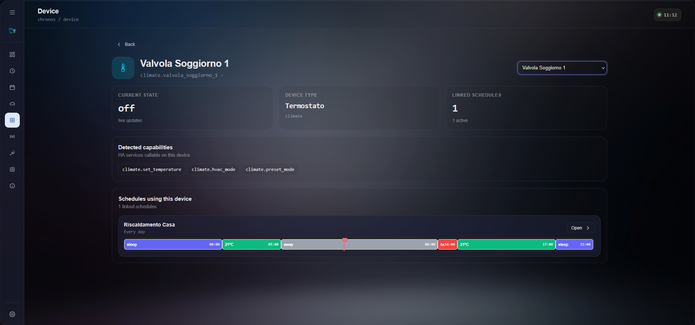

The **Device detail** section shows information about a single imported entity.

You can see:

| Element | Description |
|---|---|
| Current state | Current state of the entity |
| Device type | Type detected by Chronos |
| Linked schedules | Schedules that use this device |
| Detected capabilities | Home Assistant services Chronos can call on this entity |

Example for a thermostat:

```text
climate.set_temperature
climate.set_hvac_mode
climate.set_preset_mode
```

Use this section when an action is missing or when you want to understand which services are available for a device.

---

## Examples section

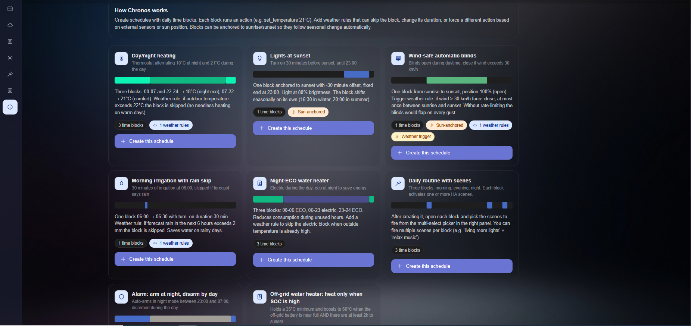

The **Examples** section contains ready made schedule templates.

Use this section when you are not sure where to start.

Available examples include:

| Example | Purpose |
|---|---|
| Day/night heating | Alternates eco and comfort temperatures |
| Lights at sunset | Turns lights on around sunset |
| Wind safe automatic blinds | Protects blinds using wind rules |
| Morning irrigation with rain skip | Runs irrigation only when useful |
| Night ECO water heater | Reduces energy use at night |
| Daily routine with scenes | Activates scenes during the day |

After creating an example schedule, open it and adapt:

- Time blocks.
- Devices.
- Actions.
- Weather rules.
- Repeat days.

---

## Settings section

The **Settings** section controls the global behavior of Chronos.

These settings apply to all schedules.

---

### Language and weather source

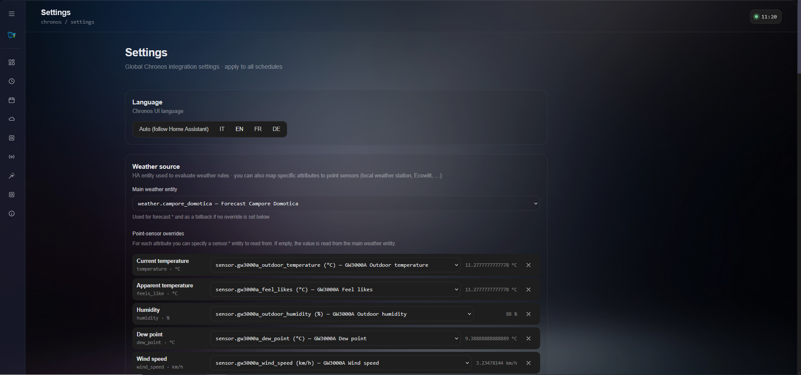

The language option controls the Chronos interface language.

Available options:

- Auto, follow Home Assistant.
- Italian.
- English.
- French.
- German.

The weather source controls which Home Assistant entity Chronos uses for weather rules.

You can select a main `weather.*` entity and optionally override specific attributes with dedicated sensors.

This is useful if you have a local weather station.

Example:

```text
Temperature from a local outdoor sensor
Humidity from a local humidity sensor
Wind speed from a local anemometer
Dew point from a local weather station
```

If an override is empty, Chronos uses the main weather entity for that attribute.

---

### Execution behavior

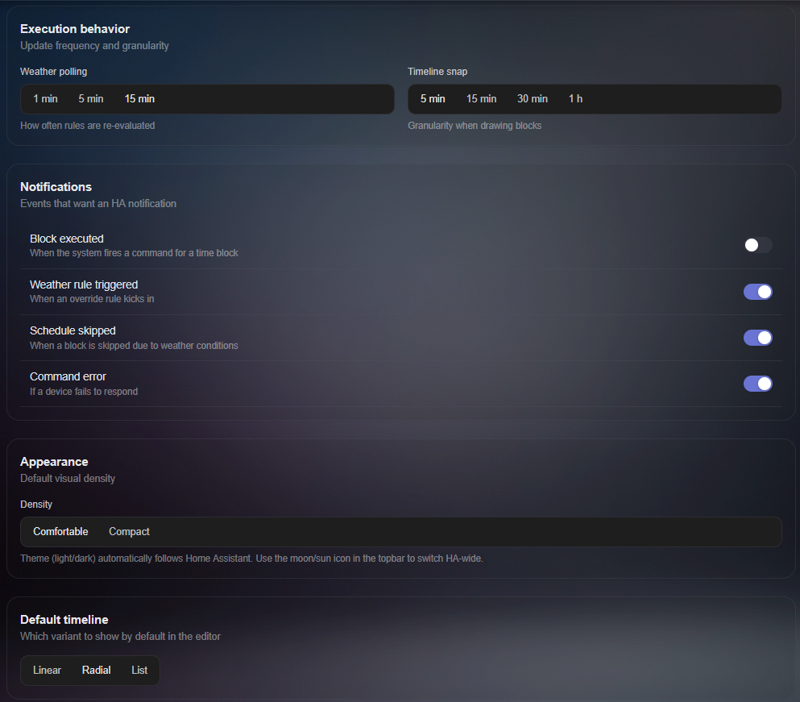

The **Execution behavior** settings control how often Chronos updates and how precise the editor should be.

| Setting | Description |
|---|---|
| Weather polling | How often weather rules are re evaluated |
| Timeline snap | Editing precision when moving or resizing blocks |

Example:

```text
5 minute snap: precise schedules
30 minute snap: cleaner schedules
1 hour snap: simple routines
```

---

### Notifications

The **Notifications** settings control which Home Assistant notifications Chronos should send.

You can enable notifications for:

| Notification | Meaning |
|---|---|
| Block executed | A time block has been executed |
| Weather rule triggered | A weather rule has affected a schedule |
| Schedule skipped | A block or schedule has been skipped |
| Command error | A Home Assistant service call failed |

These notifications are useful for testing and troubleshooting.

---

### Appearance

The **Appearance** settings control how dense the Chronos interface is.

| Option | Description |
|---|---|
| Comfortable | More spacing, easier to read |
| Compact | More information visible on screen |

The default timeline option chooses which editor section opens first:

- Linear.
- Radial.
- List.

---

### Device colors

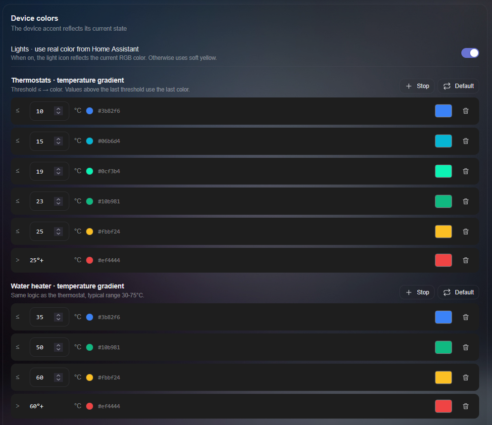

The **Device colors** settings control how devices are represented in timelines and cards.

For lights, Chronos can use the real RGB color from Home Assistant when available.

For thermostats and water heaters, Chronos can use temperature gradients.

Example:

| Temperature range | Example color meaning |
|---|---|
| Low temperature | Blue |
| Comfort temperature | Green |
| High temperature | Yellow |
| Very high temperature | Red |

You can customize thresholds and colors to match your preferences.

---

## Scene schedules

Scene schedules are used to activate one or more Home Assistant scenes at specific times.

Scenes are not managed from the normal device list. They have a dedicated schedule type.

Example:

```text
07:00    activate Morning scene
20:30    activate Evening scene
23:30    activate Night scene
```

A single time block can activate multiple scenes.

Use scene schedules when you already have Home Assistant scenes and you want Chronos to decide when they should run.

---

## Automation schedules

Automation schedules are used to control Home Assistant automations.

Each block can:

- Turn on one or more automations.
- Turn off one or more automations.
- Trigger one or more automations.

Use automation schedules when you want to enable, disable or manually trigger existing automations based on time, sun position or weather rules.

---

## Troubleshooting

### My schedule does not run

Check the following:

- The schedule is enabled.
- The current day is selected in the Repeat section.
- The current date is inside the yearly date range, if enabled.
- The target device is still available in Home Assistant.
- The active block targets the correct device.
- A weather rule is not skipping the block.

Then open the **Live status** section to see what Chronos is doing right now.

---

### My block is skipped

Open the schedule and check the **Weather rules** section.

A rule may be active and may be skipping the block because its condition is true.

Examples:

```text
Heating skipped because forecast.temp_min_today > 22°C
Irrigation skipped because condition is rainy
```

---

### The timeline looks different from the screenshots

Chronos has three schedule editor sections:

- Linear.
- Radial.
- List.

They are only different visual representations of the same schedule.

You can switch between them inside the schedule editor or choose the default one in Settings.

---

### I cannot find scenes or automations in Manage devices

This is expected.

Scenes and automations use dedicated schedule types.

Create them from the Overview section using:

- **Schedule scenes**
- **Schedule automations**

---

### I changed something but nothing happens

Check the following:

- Changes were saved.
- The schedule is enabled.
- The selected block is currently active.
- The target device is available in Home Assistant.
- A weather rule is not overriding the normal behavior.

If command error notifications are enabled, Chronos can notify you when a Home Assistant service call fails.

---

## Recommended first test

For the first test, start with a simple light schedule.

Example:

```text
18:00 → 23:00    turn on light
23:00 → 23:55    turn off light
```

After this works, try adding:

- A second block.
- A weather rule.
- Multiple devices.
- The Week view.
- The Live status section.

Once the basic workflow is clear, you can create more advanced schedules for heating, irrigation, blinds, water heaters, scenes and automations.

